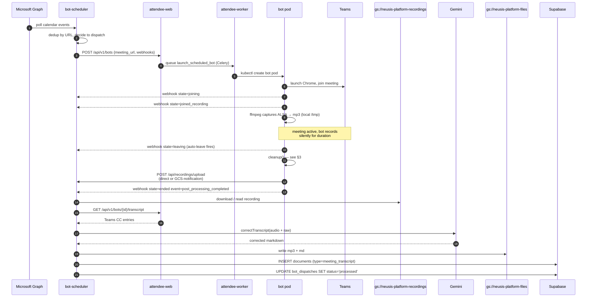
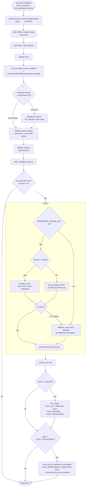
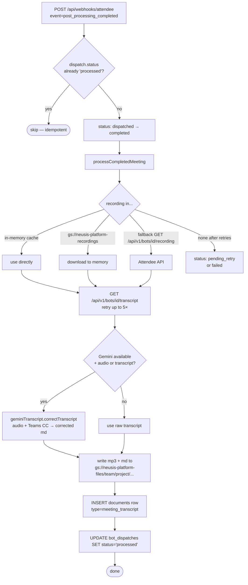

# Bot Flow — Attendee + Bot-Scheduler Architecture

End-to-end view of what happens from a calendar event to a transcribed meeting document. Two services collaborate:

- **`neusis-bot-scheduler`** (Cloud Run, Node.js/Hono) — calendar polling, bot dispatch, webhook receipt, post-processing into Neusis DB. Repo: `neusis-product/apps/api-bot-scheduler`.
- **Attendee** (GKE Autopilot, Django + ephemeral bot pods) — runs the headless Chrome bot, captures audio, uploads recording.

---

## 1. Component diagram

```mermaid
flowchart LR
  subgraph EXT[External]
    Cal[Microsoft Graph<br/>Calendar API]
    Teams[Microsoft Teams<br/>meeting]
    Gem[Gemini API<br/>2.0-flash]
  end

  subgraph CR[Cloud Run]
    BS[neusis-bot-scheduler<br/>Hono + Node.js]
  end

  subgraph SUP[Supabase Postgres<br/>multi-tenant]
    BDb[(bot_dispatches)]
    Doc[(documents)]
    CC[(calendar_connections)]
  end

  subgraph GKE[GKE Autopilot · attendee namespace]
    Web[attendee-web<br/>Django/Gunicorn]
    Wkr[attendee-worker<br/>Celery]
    Sch[attendee-scheduler]
    BotPod[bot-pod-N<br/>Chrome + ffmpeg<br/>per meeting, ephemeral]
    Redis[redis<br/>in-cluster]
  end

  subgraph GCP[GCP managed]
    SQL[(Cloud SQL Postgres<br/>Attendee DB)]
    GCSrec[gs://neusis-platform-recordings<br/>recording cache]
    GCSfiles[gs://neusis-platform-files<br/>durable mp3 + md]
    GCSfb[gs://attendee-recordings-<br/>neusis-platform<br/>Attendee fallback]
  end

  Cal -->|poll events| BS
  BS <-->|reads/writes| BDb
  BS -->|POST /api/v1/bots| Web
  Web --> SQL
  Web -->|enqueue| Redis
  Wkr -->|consume| Redis
  Wkr -->|create K8s pod| BotPod
  Sch --> SQL
  Sch -->|state cleanup| Redis

  BotPod <-->|join + audio| Teams
  BotPod -->|HTTP POST mp3<br/>or GCS-notification| BS
  BotPod -.->|fallback if HTTP fails| GCSfb
  BotPod -->|state-change webhooks| BS
  BotPod -->|>30 MB direct| GCSrec

  BS -->|read recording| GCSrec
  BS -->|GET /api/v1/bots/{id}/transcript| Web
  BS -->|correctTranscript| Gem
  BS -->|write mp3 + md| GCSfiles
  BS -->|insert| Doc
  BS -->|update status| BDb
```

### Key buckets and their purpose

| Bucket | Owner | Purpose |
|---|---|---|
| `gs://neusis-platform-recordings/` | bot-scheduler | Staging cache for recordings (uploaded via direct HTTP or GCS-notification) |
| `gs://neusis-platform-files/` | bot-scheduler | **Durable** copy. `<team>/<project>/original-sources/meetings/<stem>.mp3` and `<team>/<project>/extracted/meetings/<stem>.md` |
| `gs://attendee-recordings-neusis-platform/` | Attendee | Fallback when HTTP upload to bot-scheduler fails (e.g. Cloud Run 32 MiB body cap) |

---

## 2. Lifecycle sequence



---

## 3. Bot pod cleanup chain (recently hardened)

The most failure-prone segment of the lifecycle. This is what runs after auto-leave fires.



### Two fixes encoded above

| Fix | File | Why |
|---|---|---|
| **ffmpeg `wait(timeout=15)` + SIGKILL fallback** | `bots/bot_controller/screen_and_audio_recorder.py` | ffmpeg can block forever in an ALSA read syscall and ignore SIGTERM. Without the timeout, the whole cleanup stalls until the 240s SIGKILL safety, and the upload step never runs. Recording lost. |
| **Force `LEAVING → POST_PROCESSING` after upload** | `bots/bot_controller/bot_controller.py` | The `MEETING_ENDED` message that normally drives this transition is consumed by the Redis listener thread, which can be torn down before processing the message. Without the force, the bot stays in `LEAVING`, `POST_PROCESSING_COMPLETED` is never created, and bot-scheduler waits forever. |

### Pre-existing quirks (not failures)

- **`only_participant_in_meeting_timeout` rarely fires.** Teams "inactive participants" linger in the user list; the bot's counter doesn't filter them. Bots fall back to `silence_timeout` (10 min after last audio) instead of leaving 5 min after everyone else does.
- **ffmpeg always needs the SIGKILL path** in this Chrome+ALSA build. Recording is fine (mp3 frames are independent), but cleanup is consistently 15s slower than ideal. Possible follow-ups: try `ffmpeg -nostdin` or send `q` via stdin instead of SIGTERM.

---

## 4. Bot-scheduler post-processing detail

Triggered by the `post_processing_completed` webhook (`apps/api-bot-scheduler/src/routes/webhooks.ts:126`).



### Project routing

If the bot email had a plus-tag (`bot+team-slug--project-slug@neusis.ai`), the team/project slugs are extracted and applied. Otherwise files land in `project_holding-area/` and the document is associated to no project. This is by design (see `apps/api-bot-scheduler/src/services/calendar-scheduler.service.ts`).

---

## 5. State machine — Bot states & transitions

```mermaid
stateDiagram-v2
  [*] --> SCHEDULED: bot created via API
  SCHEDULED --> JOINING: launch_scheduled_bot fires
  JOINING --> JOINED_NOT_RECORDING: BOT_JOINED_MEETING
  JOINED_NOT_RECORDING --> JOINED_RECORDING: BOT_RECORDING_PERMISSION_GRANTED
  JOINED_RECORDING --> LEAVING: LEAVE_REQUESTED<br/>(silence_timeout, only_participant, etc.)
  LEAVING --> POST_PROCESSING: BOT_LEFT_MEETING<br/>(MEETING_ENDED message OR forced in cleanup)
  POST_PROCESSING --> ENDED: POST_PROCESSING_COMPLETED<br/>**fires webhook to bot-scheduler**
  ENDED --> [*]

  note right of LEAVING: cleanup() runs:<br/>ffmpeg stop → upload → state transition
  note right of POST_PROCESSING: utterances flushed,<br/>recording in GCS,<br/>transcript ready
```

The webhook to bot-scheduler fires on **every** state change; the only one that triggers transcript correction is `post_processing_completed`.

---

## 6. Where things live

| Concern | File | Notes |
|---|---|---|
| Bot pod creation params | `bots/bot_pod_creator/bot_pod_creator.py` | CPU/mem requests, termination_grace_period_seconds |
| Bot lifecycle / cleanup | `bots/bot_controller/bot_controller.py` | the `cleanup()` method |
| Recorder lifecycle | `bots/bot_controller/screen_and_audio_recorder.py` | ffmpeg start/stop |
| Web adapter (Teams UI) | `bots/web_bot_adapter/web_bot_adapter.py`, `bots/teams_bot_adapter/` | Selenium clicks, captions, leave |
| State transitions | `bots/models.py` (`BotEventManager.VALID_TRANSITIONS`) | which event triggers which transition |
| HTTP uploader | `bots/bot_controller/http_file_uploader.py` | direct vs GCS-notification choice |
| GCS uploader (fallback) | `bots/bot_controller/gcs_file_uploader.py` | uses Workload Identity |
| Scheduler loop | `bots/management/commands/run_scheduler.py` | launches scheduled bots, cleans up zombies |
| Bot-scheduler entrypoint | `neusis-product/apps/api-bot-scheduler/src/index.ts` | |
| Bot-scheduler webhooks + upload | `neusis-product/apps/api-bot-scheduler/src/routes/webhooks.ts` | |
| Bot-scheduler Attendee client | `neusis-product/apps/api-bot-scheduler/src/services/attendee.service.ts` | constructs the `POST /api/v1/bots` payload |
